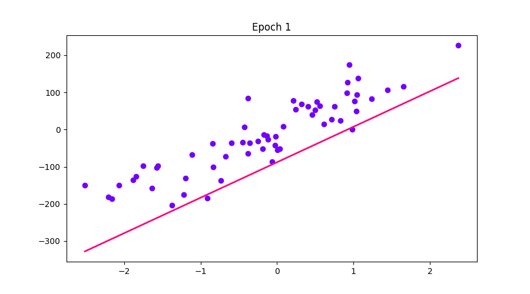
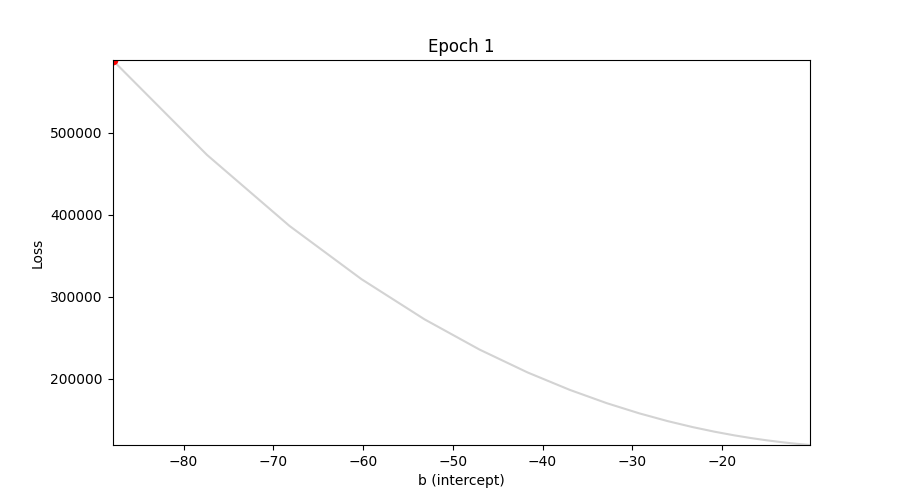
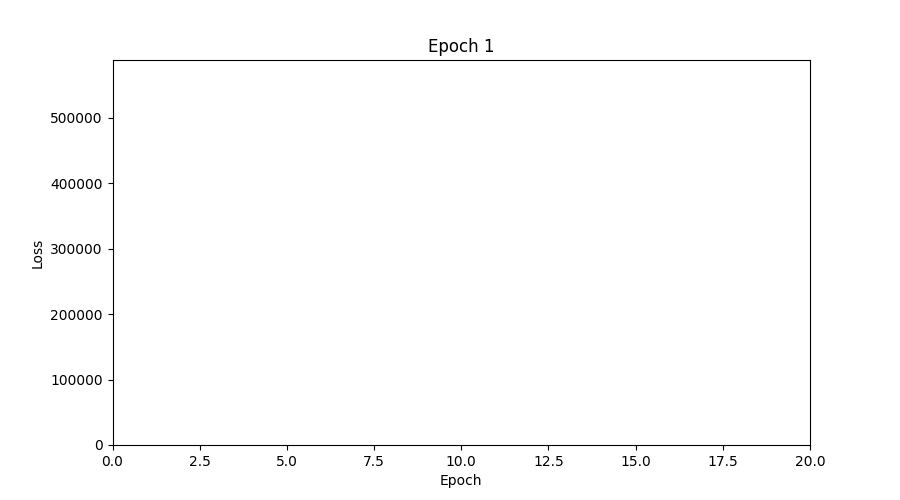
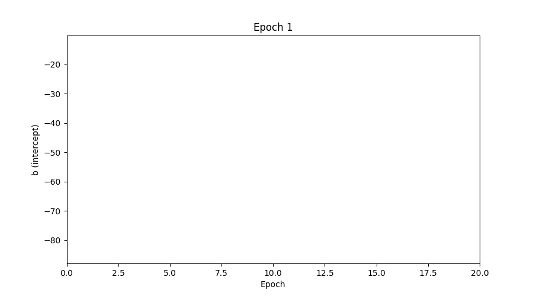
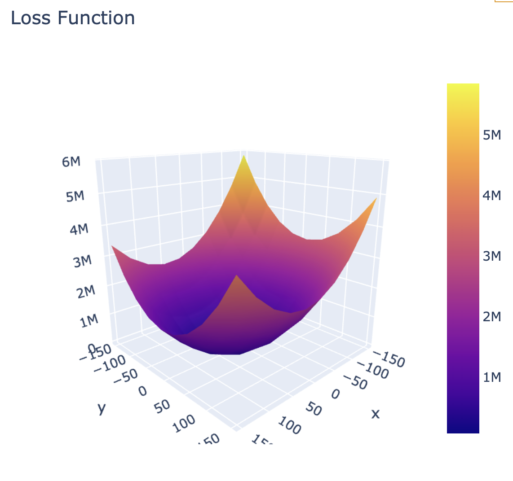
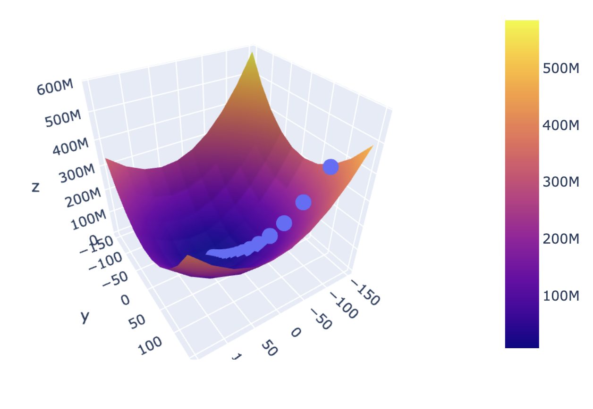
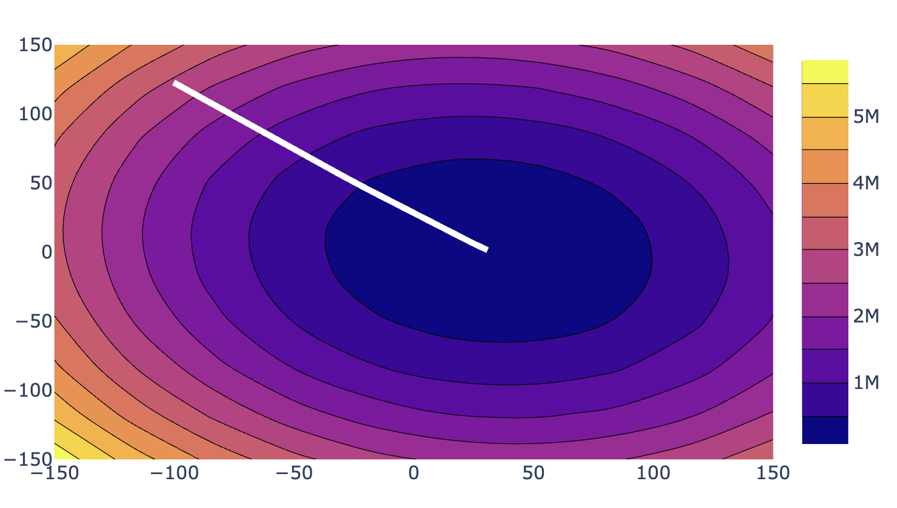

### From Random Line To Best Fit Line

### Loss vs intercept

### Loss vs epochs

### Intercept vs epochs

### Loss function

### Gradient Descent in Action on 3D Loss Function

### Contour plot
