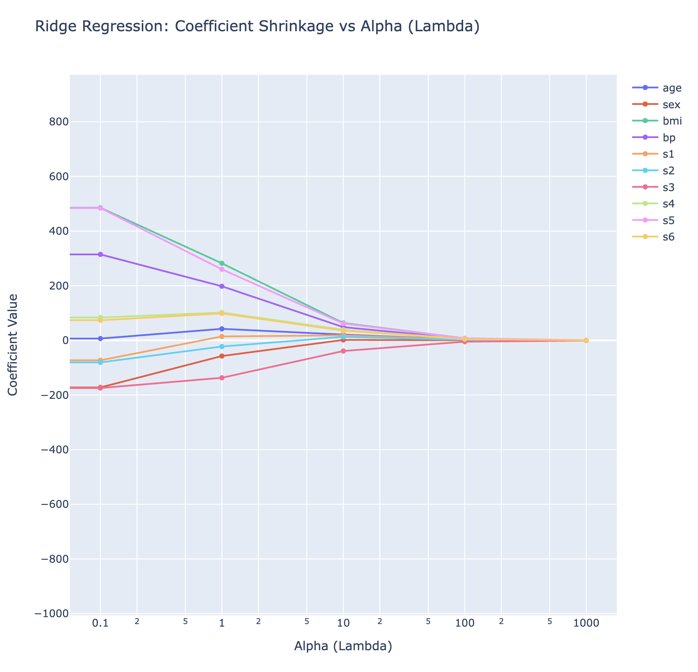
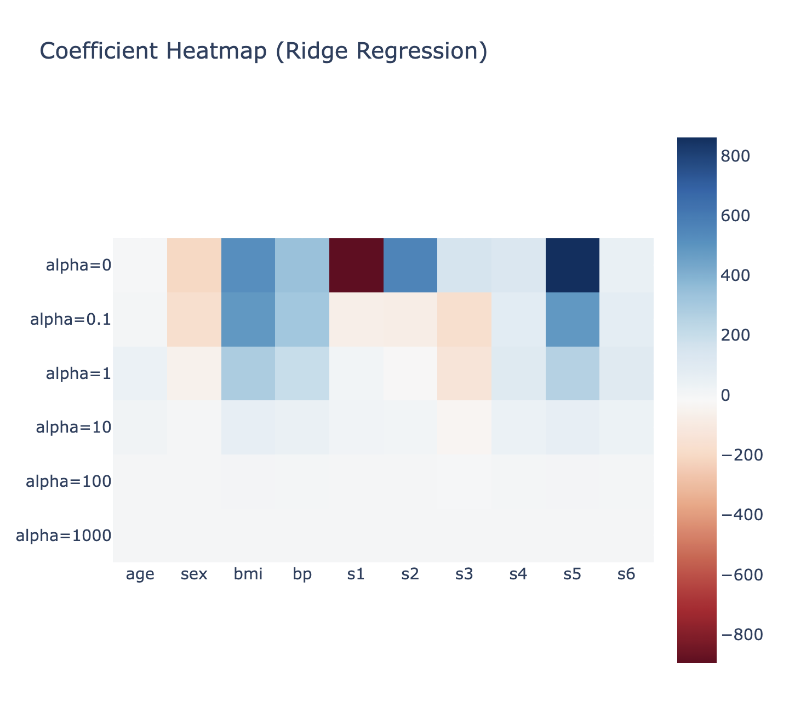
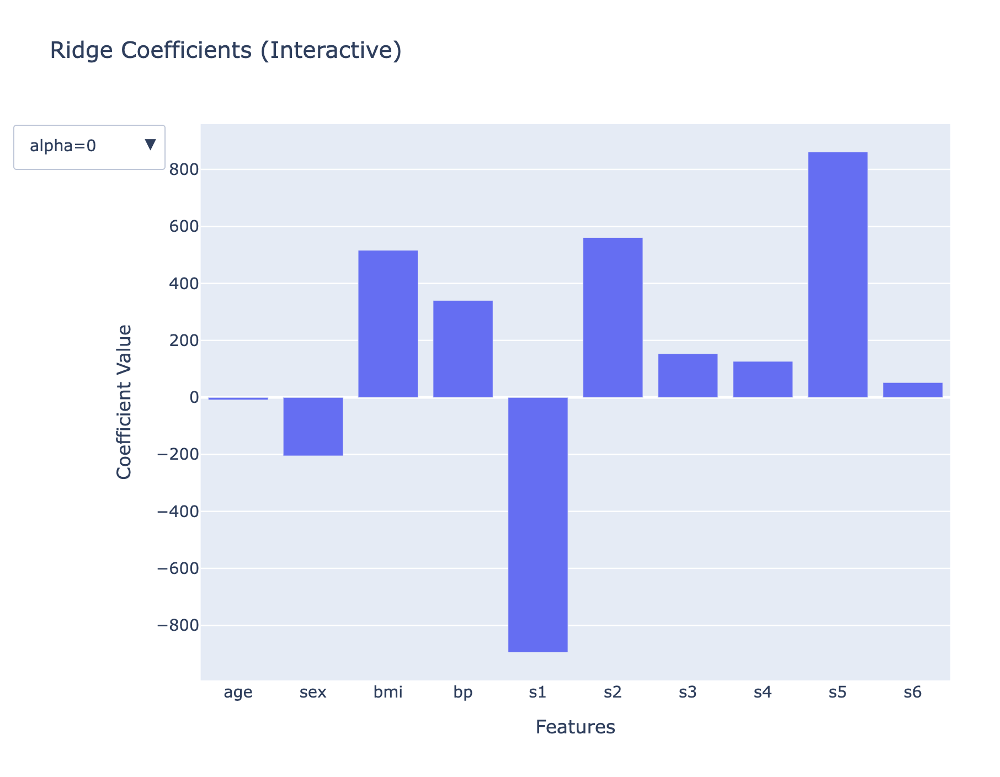
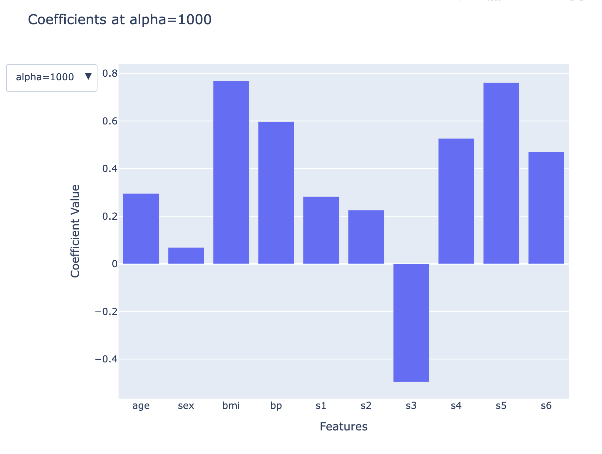
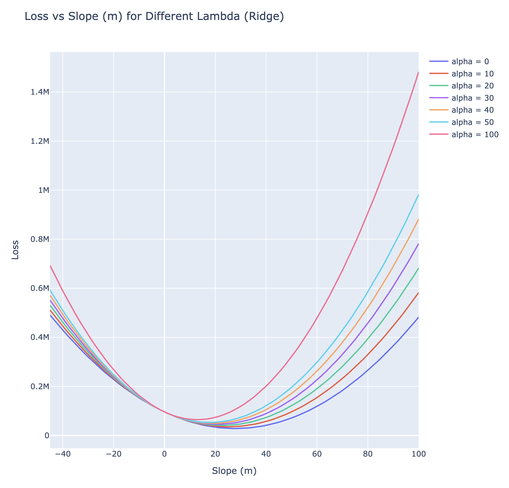

# Key understandings of ridge regression

## Higher values are impacted more

## Coefficient heatmap

## How coefficients get affected?

### At lambda = 0

## At lambda = 1000

## Impact on loss function
